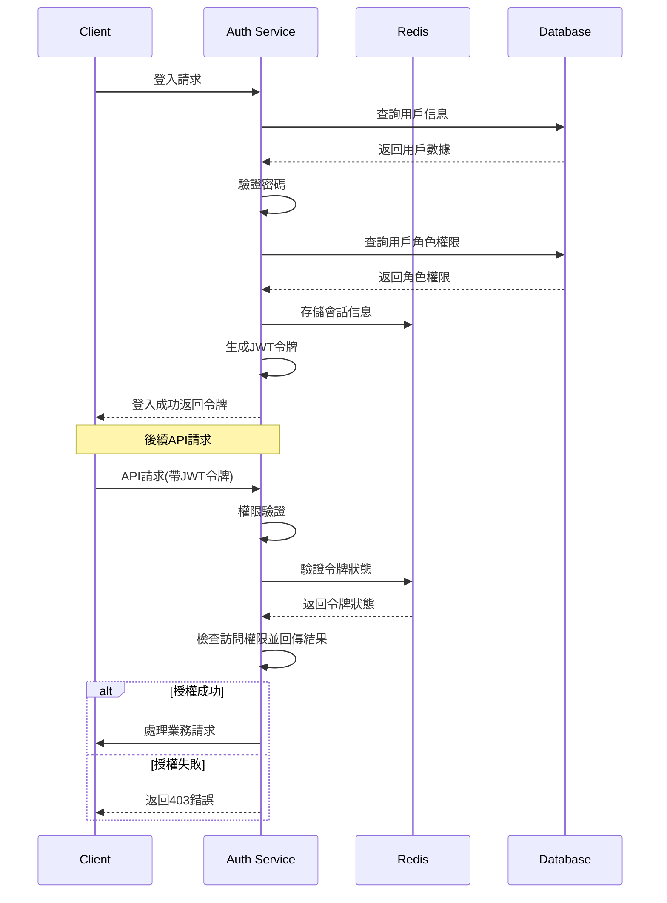

# 遊戲平台 RBAC 權限管理系統

## 1. 項目概述
本項目旨在開發一個獨立的、基於HTTP調用的RBAC（基於角色的訪問控制）服務，為微服務架構提供統一的權限管理。該服務作為權限中心，負責用戶、角色、權限的管理與授權驗證。

### 1.1 設計原則
- 職責單一：專注於權限管理，不涉及其他業務邏輯
- 高可用性：支持集群部署，避免單點故障（無狀態、涉及同步操作使用redis鎖）
- 可擴展性：支持自定義權限模型和權限規則
- 高性能：低延遲響應，支持大並發請求
- 易集成：提供簡單清晰的API，便於其他服務接入
- 安全性：保障權限數據安全和授權過程安全

### 1.2 核心功能
1. 身份認證模組
   - 基於JWT認證方式
   - 令牌管理（生成、驗證、刷新）
   - JWT黑名單管理

2. 權限管理模組
   - 用戶管理：創建、查詢、更新、刪除用戶信息
   - 角色管理：角色定義、角色分配、角色層級
   - 權限管理：權限定義、權限分配、權限檢查
   - 資源管理：定義、組織和管理受保護資源

3. 審計日誌模組
   - 記錄權限變更操作
   - 記錄授權請求和決策結果
   - 支持查詢和分析審計日誌

## 2. 系統架構圖

## 3. 系統時序圖

### 3.1 用戶認證和授權流程


## 4. 數據模型

### 4.1 用戶模型
```go
type User struct {
    UID      string          `json:"uid"`      // 唯一標識
    Username string          `json:"username"`  // 授權登錄用戶名
    Password string          `json:"-"`         // 授權登錄密碼
    Status   string          `json:"status"`    // active/deactive
    Metadata json.RawMessage `json:"metadata"`  // 擴展信息
}
```

### 4.2 角色模型
```go
type Role struct {
    RID      string          `json:"rid"`      // 唯一標識
    Name     string          `json:"name"`      // 角色名
    Desc     string          `json:"desc"`      // 描述信息
    Metadata json.RawMessage `json:"metadata"`  // 擴展信息
}
```

### 4.3 權限模型
```go
type Permission struct {
    PID      string          `json:"pid"`      // 唯一標識
    Resource string          `json:"resource"`  // 資源標識
    Action   string          `json:"action"`    // 操作類型
    Desc     string          `json:"desc"`      // 描述信息
    Metadata json.RawMessage `json:"metadata"`  // 擴展信息
}
```

### 4.4 用戶角色關聯
```go
type UserRole struct {
    UID string `json:"uid"`  // 用戶標識
    RID string `json:"rid"`  // 角色標識
}
```

### 4.5 審計日誌
```go
type AuditLog struct {
    ID              string          `json:"id"`              // 日誌唯一標識
    Operation       string          `json:"operation"`       // 操作類型
    EntityID        string          `json:"entity_id"`       // 操作的資源id
    EntityType      string          `json:"entity_type"`     // 操作的資源類型
    OperationID     string          `json:"operation_id"`    // 操作者id
    OperationResult string          `json:"operation_result"`// 操作結果
    Details         json.RawMessage `json:"details"`         // 操作詳情
}
```

## 5. API端點

### 5.1 用戶管理
- `POST /v1/users` - 創建用戶
- `GET /v1/users` - 查詢用戶列表
- `GET /v1/users/{id}` - 獲取指定用戶
- `PUT /v1/users/{id}` - 更新用戶信息
- `DELETE /v1/users/{id}` - 刪除用戶

### 5.2 角色管理
- `POST /v1/roles` - 創建角色
- `GET /v1/roles` - 查詢角色列表
- `GET /v1/roles/{id}` - 獲取指定角色
- `PUT /v1/roles/{id}` - 更新角色
- `DELETE /v1/roles/{id}` - 刪除角色

### 5.3 權限管理
- `POST /v1/permissions` - 創建權限
- `GET /v1/permissions` - 查詢權限列表
- `GET /v1/permissions/{id}` - 獲取指定權限
- `PUT /v1/permissions/{id}` - 更新權限
- `DELETE /v1/permissions/{id}` - 刪除權限

### 5.4 關聯管理
- `POST /v1/users/{id}/roles` - 為用戶分配角色
- `DELETE /v1/users/{id}/roles/{roleId}` - 移除用戶的角色
- `GET /v1/users/{id}/permissions` - 獲取用戶所有權限
- `POST /v1/roles/{id}/permissions` - 為角色分配權限
- `DELETE /v1/roles/{id}/permissions/{permId}` - 移除角色的權限

### 5.5 認證和授權
- `POST /v1/auth/authorize` - 權限驗證
- `POST /v1/auth/refresh` - 刷新令牌
- `POST /v1/auth/revoke` - 取消授權jwt
- `POST /v1/auth/batch-revoke` - 批量取消授權jwt

### 5.6 審計日誌
- `GET /v1/audit-logs` - 查詢審計日誌
